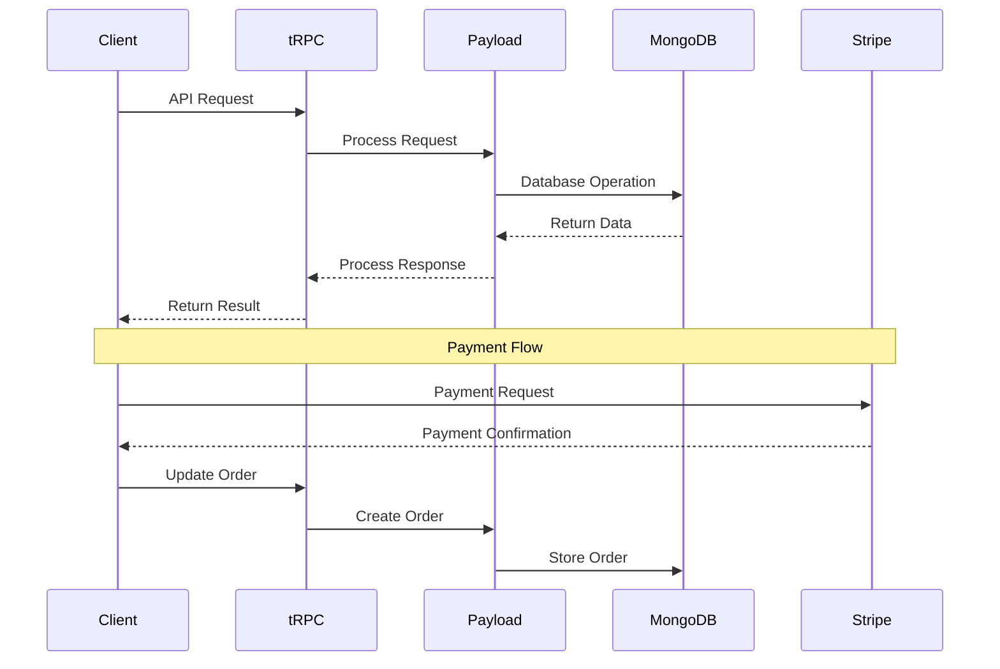
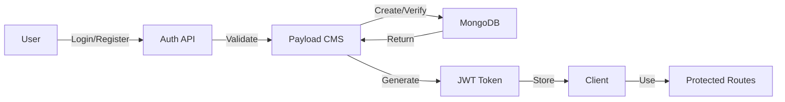
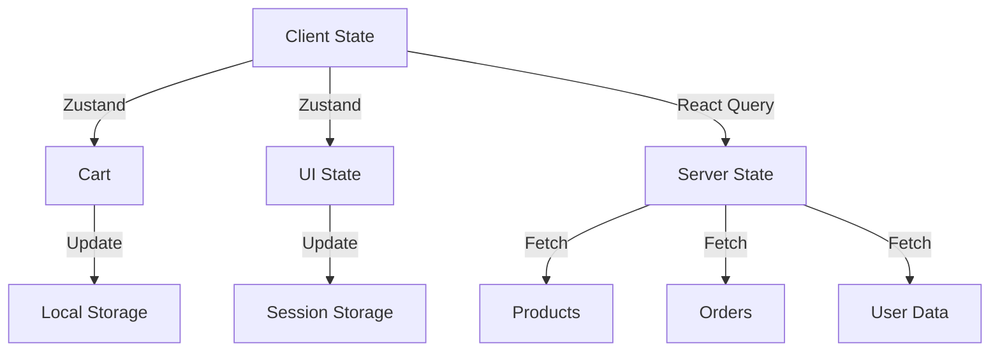
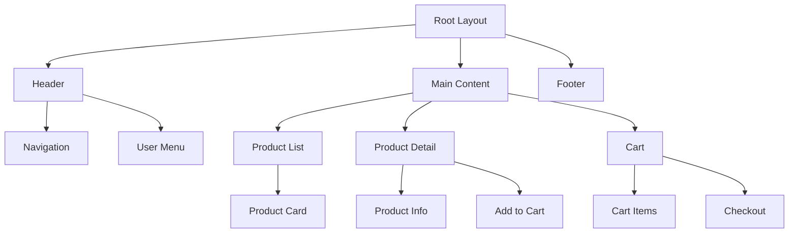
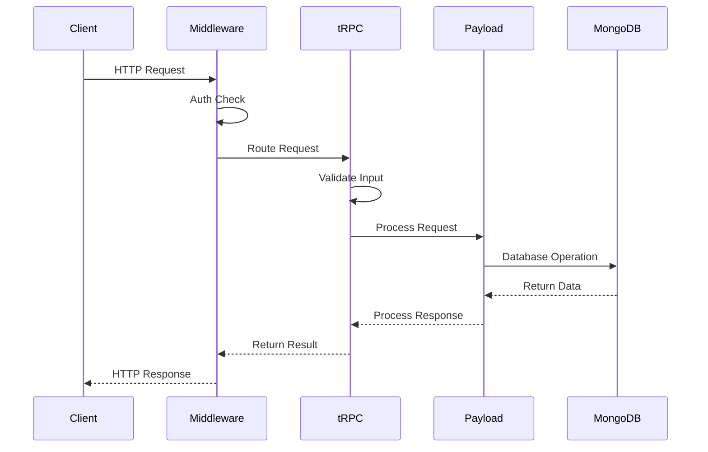
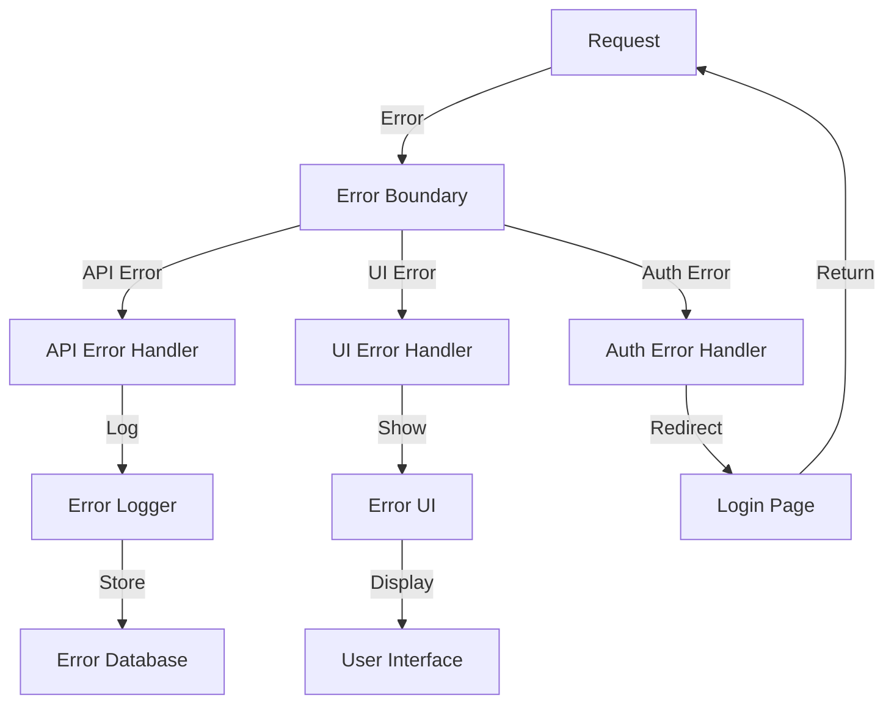
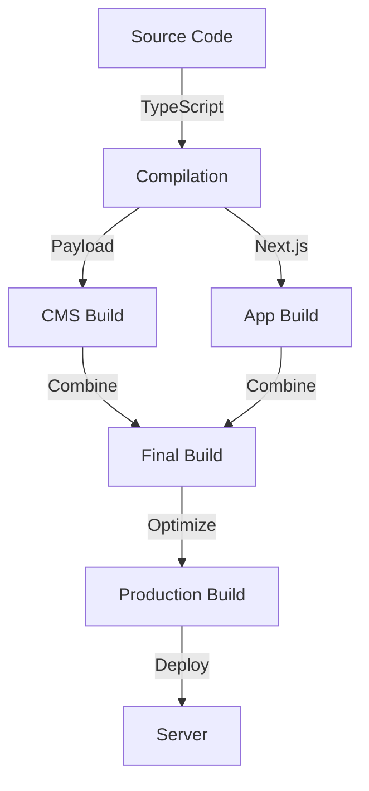
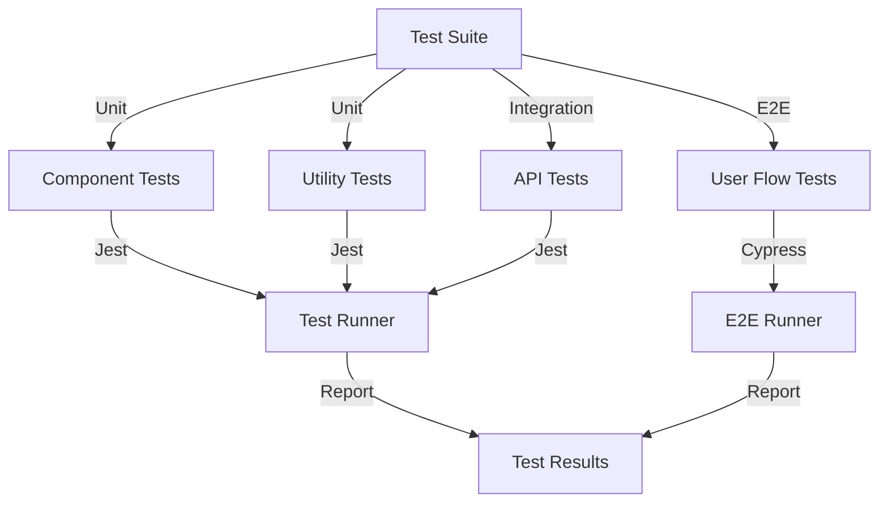

# Zonomo - Project Flow Diagrams

## Project Structure Flow

```mermaid
graph TD
    A[src/] --> B[app/]
    A --> C[components/]
    A --> D[collections/]
    A --> E[trpc/]
    A --> F[lib/]
    A --> G[hooks/]
    A --> H[config/]

    B --> B1[layout.tsx]
    B --> B2[page.tsx]
    B --> B3[(auth)/]
    B --> B4[(dashboard)/]
    B --> B5[(shop)/]

    C --> C1[ui/]
    C --> C2[forms/]
    C --> C3[layout/]
    C --> C4[product/]
    C --> C5[cart/]

    D --> D1[Users.ts]
    D --> D2[Products.ts]
    D --> D3[Orders.ts]
    D --> D4[Media.ts]
    D --> D5[ProductFiles.ts]

    E --> E1[index.ts]
    E --> E2[auth.ts]
    E --> E3[products.ts]
    E --> E4[orders.ts]
    E --> E5[context.ts]
```

## Data Flow Diagram



## Authentication Flow



## State Management Flow



## Component Hierarchy



## API Request Flow



## Error Handling Flow



## Build Process Flow



## Testing Flow



These diagrams provide a visual representation of how different parts of the application interact with each other. They help in understanding:

1. The overall project structure
2. How data flows through the application
3. The authentication process
4. State management patterns
5. Component relationships
6. API request handling
7. Error handling flow
8. Build process
9. Testing strategy

For more detailed information about each component, please refer to the README-CODEBASE.md file. 