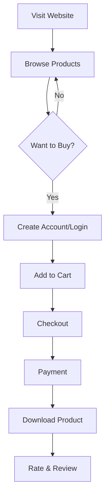
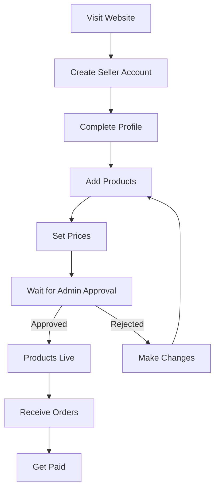
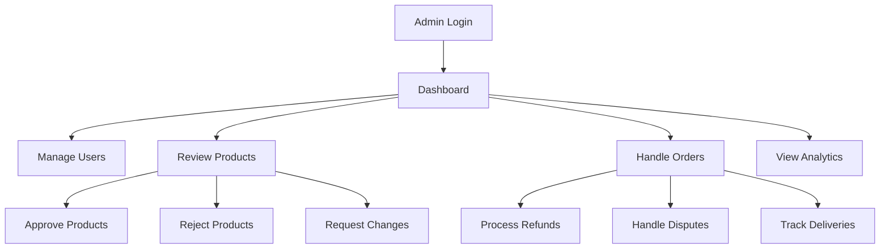
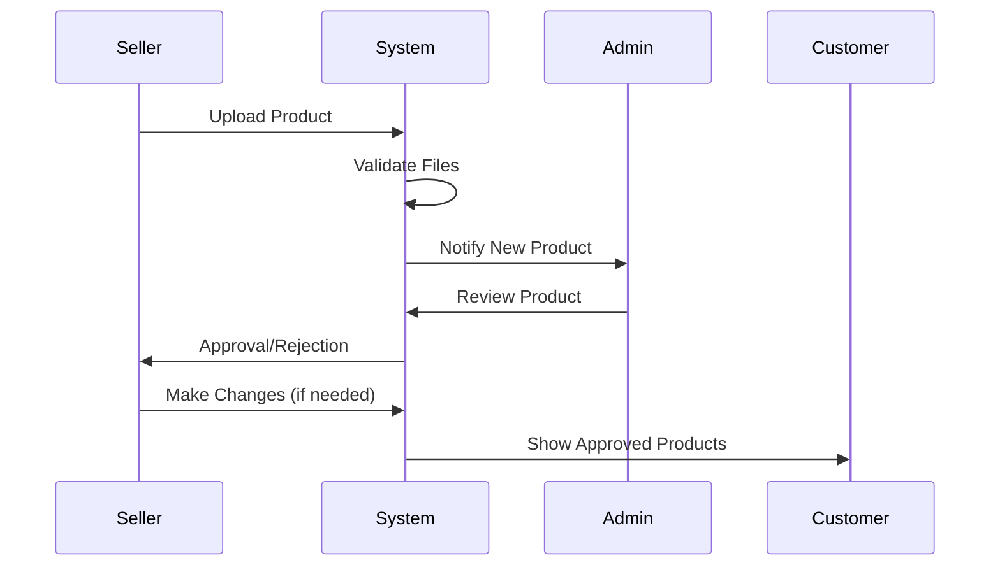
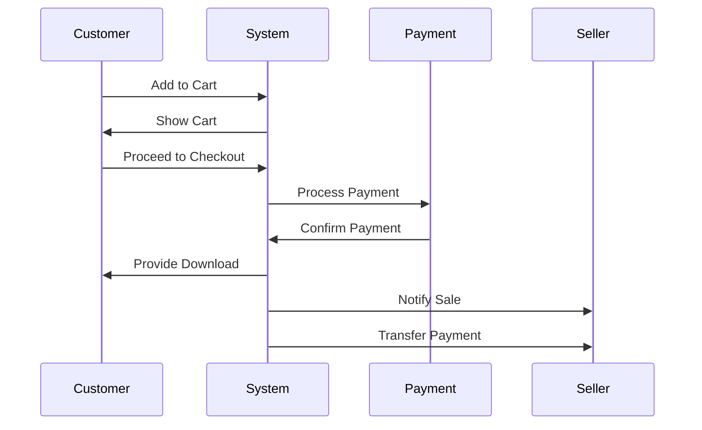
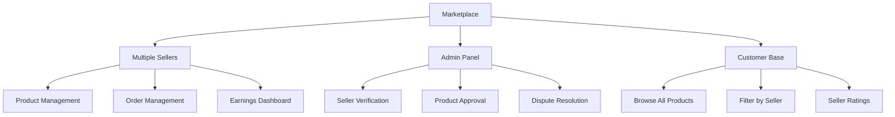
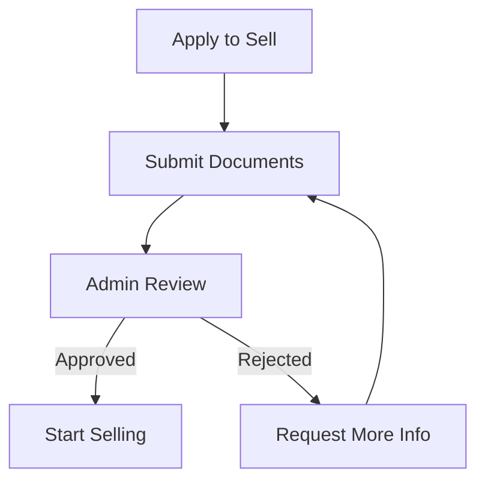
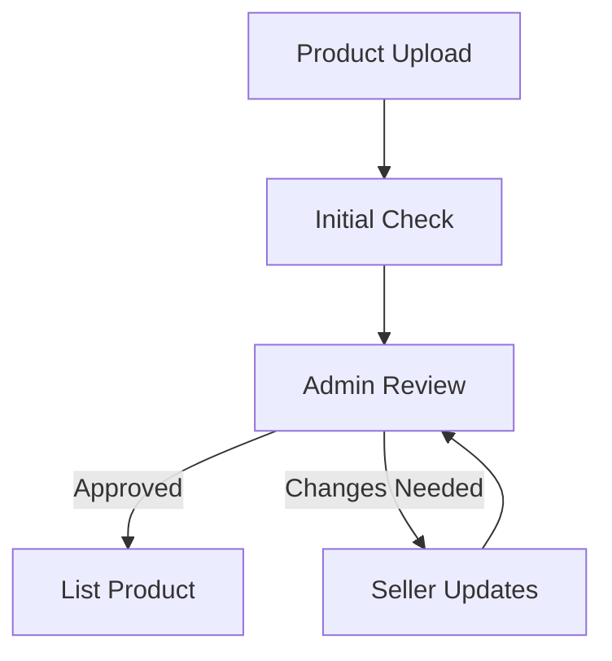
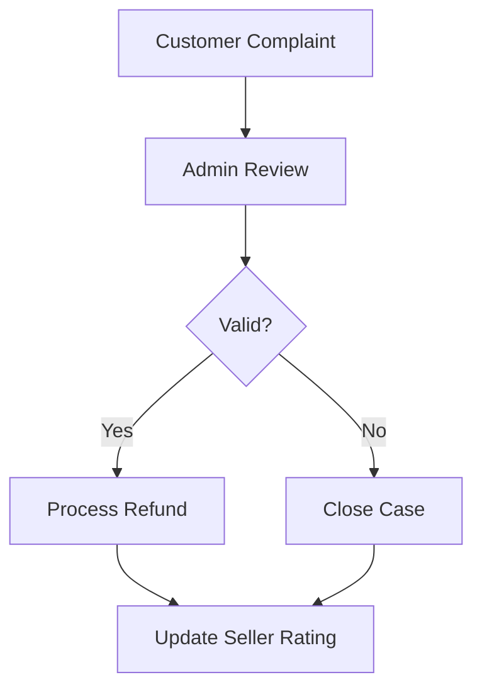

# Zonomo - User Flows and Marketplace Guide

## User Types and Their Journeys

### 1. Customer Journey

### 2. Seller Journey

### 3. Admin Journey

## How the Marketplace Works

### 1. Product Listing Process

### 2. Purchase Process

### 3. Multi-Vendor System

## Key Features Explained

### 1. Product Management
- **For Sellers:**
  - Upload digital products (files, documents, etc.)
  - Set prices and descriptions
  - Add preview images
  - Manage inventory
  - Track sales

- **For Admins:**
  - Review new products
  - Ensure quality standards
  - Handle product disputes
  - Monitor seller performance

### 2. Order Processing
- **For Customers:**
  - Browse products
  - Add to cart
  - Secure checkout
  - Instant download
  - Track order history

- **For Sellers:**
  - Receive order notifications
  - Track sales
  - Manage customer support
  - View earnings

### 3. Payment System
- Secure payment processing
- Multiple payment methods
- Automatic seller payments
- Refund handling
- Transaction history

### 4. User Management
- **Customer Features:**
  - Account creation
  - Profile management
  - Order history
  - Wishlist
  - Reviews and ratings

- **Seller Features:**
  - Seller dashboard
  - Sales analytics
  - Customer communication
  - Product management
  - Payment tracking

- **Admin Features:**
  - User management
  - Content moderation
  - Financial oversight
  - System configuration
  - Analytics and reporting

## Security and Trust

### 1. Seller Verification

### 2. Product Quality Control

### 3. Dispute Resolution

## Getting Started

### For Customers:
1. Create an account
2. Browse products
3. Add items to cart
4. Complete purchase
5. Download products
6. Leave reviews

### For Sellers:
1. Apply to become a seller
2. Complete verification
3. Set up payment details
4. Add your first product
5. Wait for approval
6. Start selling

### For Admins:
1. Access admin dashboard
2. Review pending applications
3. Monitor marketplace activity
4. Handle customer support
5. Manage seller accounts
6. Review financial reports

## Support and Help

### Customer Support:
- FAQ section
- Help center
- Contact form
- Live chat
- Email support

### Seller Support:
- Seller guidelines
- Product guidelines
- Payment information
- Marketing tools
- Analytics help

### Admin Support:
- System documentation
- Security guidelines
- Compliance information
- Technical support
- Emergency contacts

Welcome to Zonomo. Every service provider on our
platform is carefully vetted to ensure the highest quality standards. 