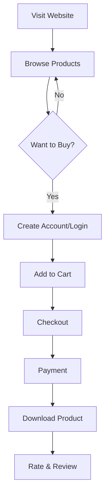
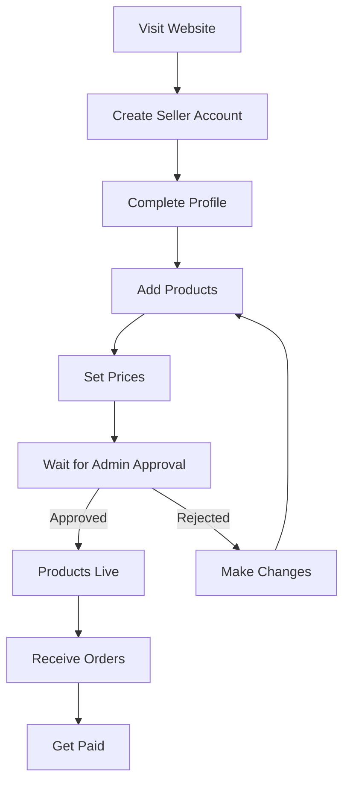
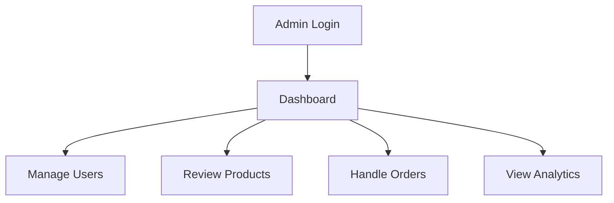
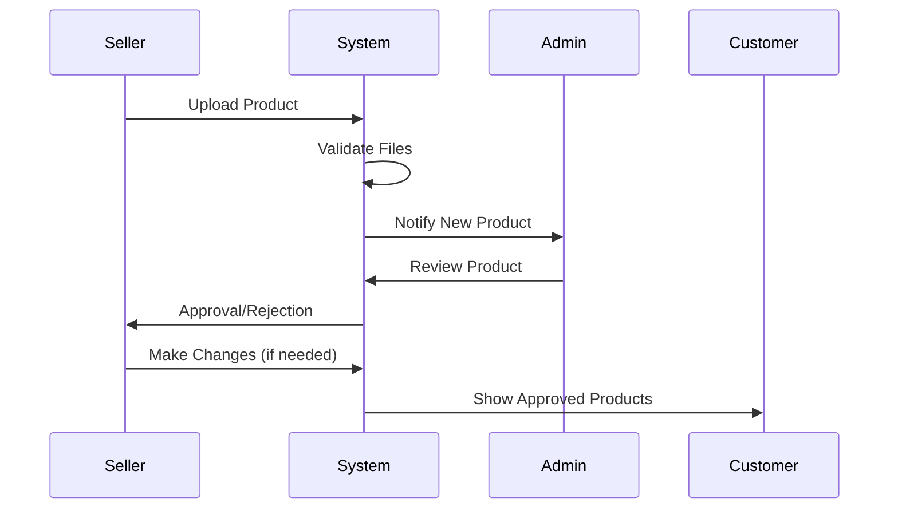
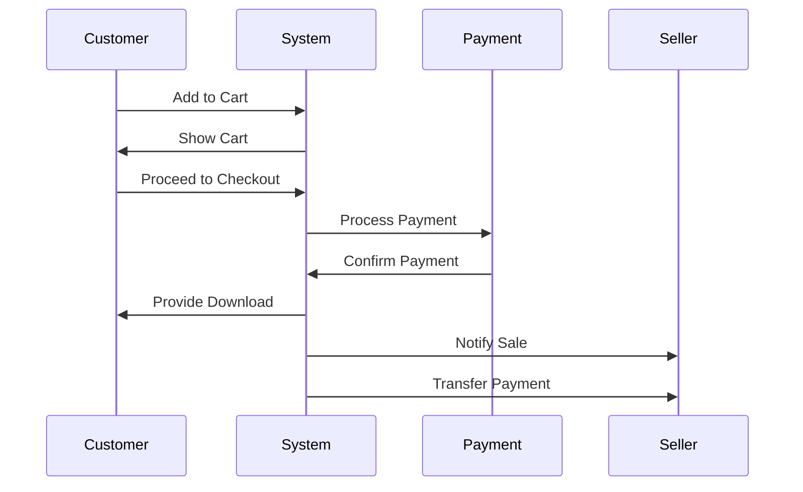
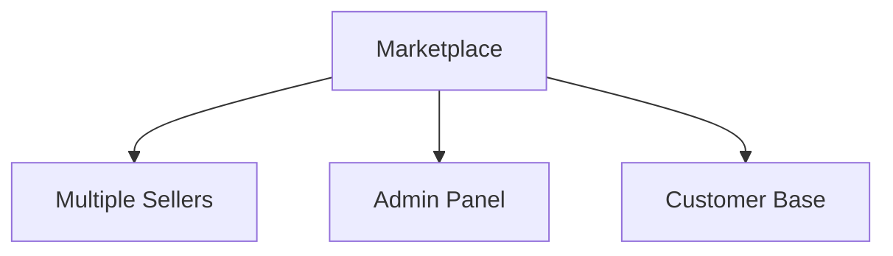
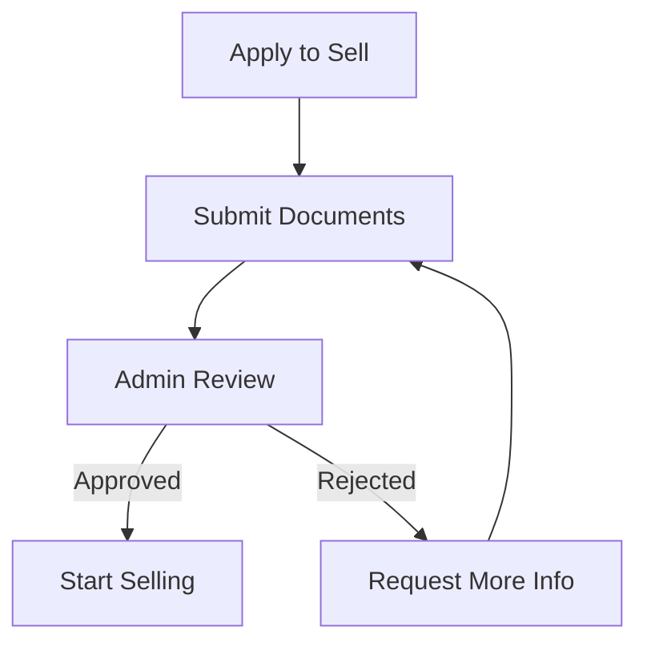
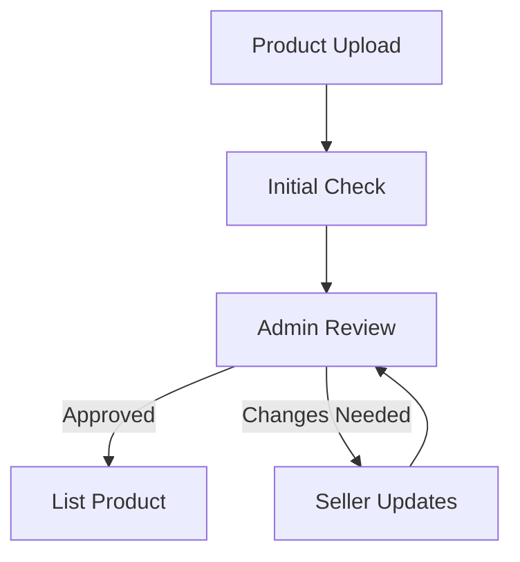
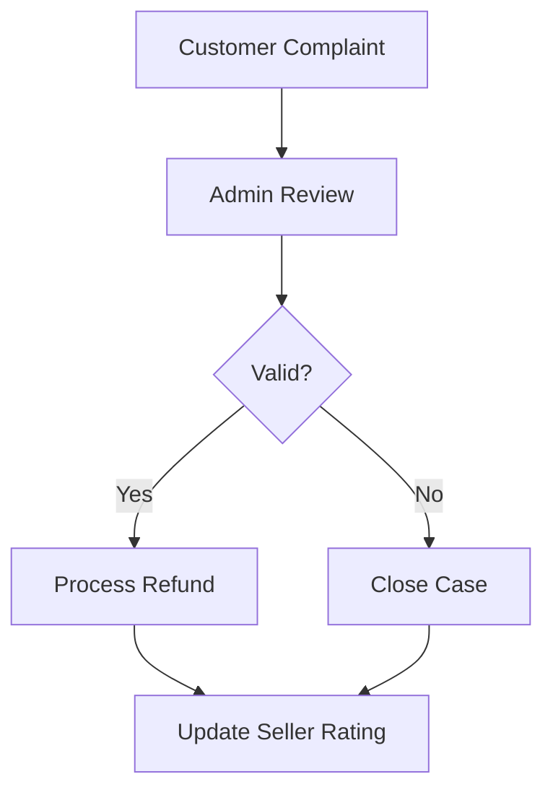

# Zonomo - User Flows & Technical Implementation

## User Types and Their Journeys

### 1. Customer Journey

**Technical Implementation:**
- **Website Visit**: Next.js 14 App Router (`src/app/page.tsx`)
- **Product Browsing**: 
  - Server Components for initial load
  - React Query for data fetching
  - Infinite scroll with Intersection Observer
- **Authentication**: 
  - Payload CMS Auth (`src/collections/Users.ts`)
  - JWT tokens for session management
- **Cart Management**: 
  - Zustand for state management (`src/hooks/use-cart.ts`)
  - Local storage persistence
- **Checkout**: 
  - Stripe integration (`src/lib/stripe.ts`)
  - tRPC procedures for order creation
- **Downloads**: 
  - Secure file delivery system
  - Rate limiting and access control

### 2. Seller Journey

**Technical Implementation:**
- **Seller Account**: 
  - Payload CMS User Collection with role-based access
  - Custom fields for seller information
- **Product Management**: 
  - Payload CMS Product Collection (`src/collections/Products.ts`)
  - File upload handling with Payload's upload feature
  - Image optimization with Next.js Image component
- **Pricing**: 
  - Decimal field type for prices
  - Currency formatting with Intl.NumberFormat
- **Approval System**: 
  - Custom Payload CMS hooks for workflow
  - Email notifications using Resend
- **Order Management**: 
  - Real-time updates with WebSocket
  - Order status tracking system

### 3. Admin Journey

**Technical Implementation:**
- **Admin Dashboard**: 
  - Payload CMS Admin UI customization
  - Custom React components for enhanced UI
- **User Management**: 
  - Payload CMS User Collection with admin access
  - Role-based permissions system
- **Product Review**: 
  - Custom admin interface
  - Bulk actions support
- **Analytics**: 
  - Custom aggregation pipelines
  - Data visualization with Chart.js

## How the Marketplace Works

### 1. Product Listing Process

**Technical Implementation:**
- **File Upload**: 
  - Payload CMS Media Collection
  - File validation with Zod
  - Virus scanning integration
- **Notification System**: 
  - Email notifications with Resend
  - WebSocket for real-time updates
- **Product Validation**: 
  - Custom Payload CMS hooks
  - Automated content checking
- **Product Display**: 
  - Server-side rendering for SEO
  - Client-side filtering and sorting

### 2. Purchase Process

**Technical Implementation:**
- **Cart System**: 
  - Zustand store with persistence
  - Optimistic updates
- **Checkout**: 
  - Stripe Elements integration
  - Custom checkout flow
- **Payment Processing**: 
  - Stripe API integration
  - Webhook handling for payment events
- **Download System**: 
  - Secure file delivery
  - Download tracking
- **Seller Notification**: 
  - Real-time updates
  - Email notifications

### 3. Multi-Vendor System

**Technical Implementation:**
- **Seller Management**: 
  - Payload CMS with custom fields
  - Role-based access control
- **Product Organization**: 
  - MongoDB aggregation for seller products
  - Efficient querying with indexes
- **Payment Distribution**: 
  - Stripe Connect for seller payouts
  - Automated payment scheduling

## Key Features Explained

### 1. Product Management
**For Sellers:**
- **Upload System**: 
  - Payload CMS Media Collection
  - File type validation
  - Size limits and restrictions
- **Pricing**: 
  - Decimal field type
  - Currency formatting
- **Inventory**: 
  - Digital product tracking
  - Download limit management

**For Admins:**
- **Review System**: 
  - Custom admin interface
  - Bulk actions
  - Automated checks

### 2. Order Processing
**For Customers:**
- **Shopping Experience**: 
  - React Query for data fetching
  - Optimistic updates
  - Real-time stock checking

**For Sellers:**
- **Order Management**: 
  - Real-time notifications
  - Order status tracking
  - Sales analytics

### 3. Payment System
- **Processing**: 
  - Stripe integration
  - Multiple payment methods
  - Secure transaction handling
- **Payouts**: 
  - Stripe Connect
  - Automated scheduling
  - Transaction history

### 4. User Management
**Customer Features:**
- **Account System**: 
  - Payload CMS Users
  - JWT authentication
  - Profile management

**Seller Features:**
- **Dashboard**: 
  - Custom React components
  - Real-time analytics
  - Order management

**Admin Features:**
- **Control Panel**: 
  - Payload CMS Admin UI
  - Custom extensions
  - Analytics integration

## Security and Trust

### 1. Seller Verification

**Technical Implementation:**
- **Document Upload**: 
  - Secure file storage
  - Document verification system
- **Review Process**: 
  - Custom admin interface
  - Automated checks
  - Manual review workflow

### 2. Product Quality Control

**Technical Implementation:**
- **Content Checking**: 
  - Automated validation
  - File scanning
  - Quality metrics
- **Review System**: 
  - Custom workflow
  - Notification system
  - Version control

### 3. Dispute Resolution

**Technical Implementation:**
- **Complaint System**: 
  - Ticket management
  - Communication system
  - Resolution tracking
- **Refund Processing**: 
  - Stripe refund API
  - Automated workflows
  - Manual override options

## Getting Started

### For Customers:
1. **Account Creation**: 
   - Next.js form handling
   - Payload CMS user creation
   - Email verification

2. **Shopping**: 
   - React Query for data
   - Zustand for cart
   - Stripe for payment

### For Sellers:
1. **Application**: 
   - Custom form handling
   - Document upload
   - Verification process

2. **Product Management**: 
   - Payload CMS integration
   - File upload system
   - Pricing management

### For Admins:
1. **Dashboard Access**: 
   - Payload CMS Admin UI
   - Custom extensions
   - Analytics integration

2. **Management Tools**: 
   - User management
   - Product review
   - Order processing

## Support and Help

### Customer Support:
- **Help System**: 
  - FAQ database
  - Ticket system
  - Live chat integration

### Seller Support:
- **Guidelines**: 
  - Documentation system
  - Video tutorials
  - Best practices

### Admin Support:
- **System Management**: 
  - Technical documentation
  - Security guidelines
  - Emergency procedures 